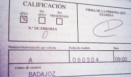

Tanto mi bros. Jaume (el Ryf) como yo hemos aprobado la teórica de la moto (permiso A). La verdad es que ha sido mucho más fácil de lo que esperaba teniendo en cuenta que vamos por libre y que conseguimos el libro el día antes del examen.
Ahora toca lo más difícil, el examen práctico en circuito cerrado... bufff, en éste hay que andarse con ojo, sobretodo después de ver una sesión en la que se examinaron cinco tipos y cayeron cuatro; el que aprobó, si no era Rossi le faltaba poco...
