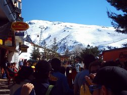

¡Vaya par de días que hemos pasado en Sierra Nevada! Esta es la tercera vez que vamos a las pistas de esquí de Granada a practicar nuestro deporte de invierno favorito: el Snowboard (perdona Dani). Desde luego, ninguno de los tres que hemos ido (Dani "el Demo", Joan "el Slap" y yo mismo "el Ryf") nos hubiésemos imaginado lo que hemos llegado a mejorar en estos dos días.

Resumen muy resumido: Salida de Badajoz hasta llegar a Granada perdiéndonos en todos los núcleos con más de 200.000 habitantes (véase Sevilla, algunos pueblos cuyo nombre desconozco, y la propia Granada). Al llegar por la tarde a Pradollano, inspeccionamos todas las tiendas y llevamos las tablas a encerar, luego vamos a cenar al albergue y comprobamos que los "señores dueños" son los mismos de todos los años.
1ª Noche: Salimos con la intención de dar una vuelta e irnos a dormir pronto pero surgen complicaciones, empezamos a conocer Valencian@s, Vitorian@s, Brasileñ@s.... total, que esa noche dormimos una hora como mucho.
1º Día de Snow: Las dos primeras horas con dolor de cabeza (motivo: se supone...), a partir de ahí nos juntamos con l@s colegas de la noche anterior y vamos mejorando exponencialmente haciéndonos casi todas las pistas incluidas las negras (impresionantes!!!).
2ª Noche: Volvemos a salir pero esta vez prometiéndonos que va a ser poco rato (se quiere venir hasta el camarero del albergue)... dormimos una hora otra vez.
2º Día de Snow: Estamos muertos, pero es el último día y ya habrá tiempo para descansar. Nos hacemos todas las pistas y fuera-pistas, nos tiramos por las negras a velocidad terminal y nos hacemos unos vuelos en el Snow-Park (una pasada!!!) y así hasta la hora de cerrar llegando en algunos momentos al fallo muscular. Sobre las 19h cargamos el coche con las tablas y nos volvemos a casa perdiéndonos (otra vez) por los nucleos más importantes del camino.

Conclusión: Hay que repetirlo.
