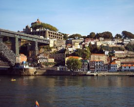
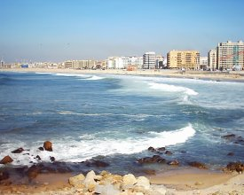

Llevamos 2 meses sin escribir nada :(  pero partir de ahora me comprometo a publicar "al menos" una notícia a la semana. En otro orden de cosas (como diría Julito) ,  hace tres semanas estuvimos en Oporto, la segunda ciudad más importante de Portugal con casi dos millones de habitantes. Fuimos a visitar a un amigo que está trabajando en Matosinhos, una ciudad costera pegada a Oporto por el norte (foto de la derecha).

Al sur y separada por el río Duero se encuentra Gaia donde estan las famosas bodegas de vino de Oporto. En la foto de la izquierda se ven algunas  bodegas y parte del puente más famoso de la ciudad: Dom Luis I,  un puente impresionante de doble altura, aunque poco estético por estar en obras.

 
Por último deciros que si alguna vez pasáis por Oporto tenéis que probar la "Francesinha", un plato típico aunque no muy saludable ;)
