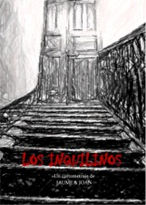

Después de varias semanas de montaje, hemos terminado el cortometraje: Los Inquilinos. Un corto de terror con bastantes escenas de tensión, en el que la cantidad de "sangre artificial" utilizada se cuenta por litros. 

El argumento trata sobre tres parapsicólogos que aceptan un trabajo en la casa de una ancianita, pero la situación se les va de las manos ya que no son fantasmas lo que encuentran, sino algo mucho peor. A primera vista parece el típico guión de una peli de serie B, pero la trama que se desarrolla es bastante más compleja... No quiero desvelar más, es mejor que lo veais.

El corto no se puede descargar desde la página, ya que está en formato DVD (ocupa más de 700 megas) y no soy partidario de disminuir la calidad, así que si queréis verlo sólo lo tenéis que pedir en la página o por <a href="/autores.php">e-mail</a>.  Como siempre, en la sección <a href="/cortos.php">nuestros cortos</a> tenéis información y algunas capturas de &#8220;Los Inquilinos". (La imagen de la derecha es un enlace a la portada del DVD del corto).

