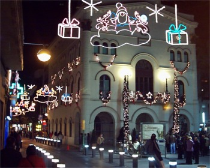
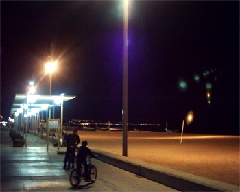
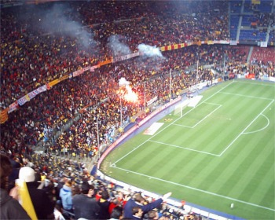
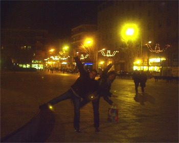

Después de este paréntesis por vacaciones en Badalona City (hogar, dulce hogar...) , os dejo unas fotos de varios momentos de estas fiestas:
 
El sitio donde se respira más ambiente navideño es l'Ajuntament, la política es lo que tiene.
 
Es triste ver la playa en invierno, echo de menos los partidos de Volley Playa.
 En un Catalunya-Argentina donde te meten tres goles hay poco que comentar, bueno sí, el ambiente fue lo mejor ;)
 
Felicidad y consumismo, siempre tan relacionados...

 
En otro orden de cosas, si os habéis quedado con ganas de conocer el orígen de la Rana Leriano, os podéis pasar por <a href="http://fbenedetti.blogalia.com/">La Cosa Húmeda</a> donde encontraréis las aventuras de su primo y mentor en esto de la educación, la <a href="http://fbenedetti.blogalia.com/historias/24549">Rana Remígio</a>. Se me olvidó comentar este dato familiar en el anterior post ;)

