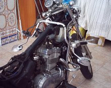

Slap y yo llevamos un tiempo pensando en pintar la moto, una Kawasaki vulcan EN500 del 92, y ya puestos hemos cambiado el sistema eléctrico, la batería, el tapizado, hemos arreglado la potencia, fijado los marcadores... etc.

En un principio la moto era así: 
<table width="100%"><tr><td></td>
<td></td></tr></table> 
Aquí se muestran imágenes de la restauración:<table width="100%"><tr><td></td>
<td></td></tr>
<tr><td></td>
<td></td></tr>
<tr><td></td>
<td></td></tr></table>
Y este es el resultado final. Yo la encuentro más "molona", ¿qué os parece?  
  
 

