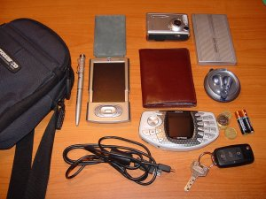

Una de las cadenas más curiosas que se ha extendido por diversos blogs es la que ha surgido en <a href="http://www.flickr.com">Flickr</a> para enseñar lo que cada uno lleva en su bolsa de gadgets. Solo tienes que subir la foto con el tag <a href="http://www.flickr.com/photos/tags/whatsinyourbag/">whatsinyourbag</a> para exponer tu lado más <a href="http://es.wikipedia.org/wiki/Geek">geek</a>. Esto es lo que llevo: 
 
Hay gente que lleva en su bolsa hasta 3 dispositivos de reproducción de MP3 distintos, 10 o 12 cables, 3 o 4 cargadores, al menos un par de móviles, varios portatiles y hasta un par de juegos de auriculares. Eso sí todo de marca y cuanto más cara mejor. El despliegue de esnobismo llega hasta el insospechado extremo de poner una nota en un cuadradito vacío para especificar la carísima marca del 'Bolso'.

Y tu, ¿qué llevas en tu bolsa?

