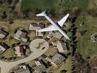

Por si alguien no lo sabe todavía, Google ha lanzado la versión Beta de <a href="http://maps.google.com/">Google Maps</a>, un servicio de localización geográfica por satélite que de momento sólo da cobertura a los EEUU. Pero lo más sorprendente es todo lo que se ha formado a su alrededor, ya que han surgido páginas donde <a href="http://flickr.com/groups/memorymaps/pool/">gente cuenta gráficamente su infancia</a>, otras donde se dan cita verdaderos <a href="http://www.googlesightseeing.com/">buscadores de lugares y detalles curiosos</a>, incluso sitios donde se debate el orígen de unos <a href="http://www.microsiervos.com/archivo/conspiranoia/marcas-misteriosas-en-google-maps.html">objetos no identificados</a> (¿ovnis?) captados por los satélites.

El otro día hice un "viajecito virtual" por la ruta 60 desde el estado de Kansas hasta Virginia Beach en la Costa Este en poco más de una hora atravesando pueblos, ciudades, bosques, montañas e incluso pasando por debajo del mar. Mi próximo viaje será hacer la famosa Ruta 66 de costa a costa, aunque tendré que sacar algo de tiempo. Dejo algunos enlaces de lugares que me han llamado la atención:

<a href="http://maps.google.com/maps?q=New%20York,NY&ll=40.689197,-74.045094&spn=0.005171,0.007918&t=k&hl=en">New York, NY (Estatua de la Libertad)</a>

<a href="http://maps.google.com/maps?q=groom%20road,rachel,%20nv&ll=37.265625,-116.438599&spn=0.162735,0.253372&t=k&hl=en">La misteriosa Área 51</a>

<a href="http://maps.google.com/maps?q=Niagara%20Falls&sll=43.078766,-79.076114&spn=0.009699,0.015385&sspn=0.019398,0.030770&t=k&hl=en">Las Cascadas de Niagara</a>

<a href="http://maps.google.com/maps?q=palmdale,ca&ll=34.637371,-118.082052&spn=0.006641,0.006652&t=k&hl=en">Bombardero espía B-2 en la Edward&#8217;s Air Force Base</a>