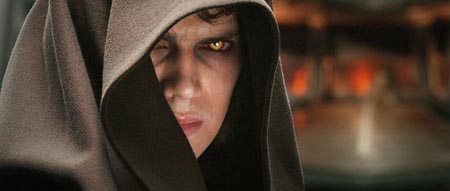

Ayer fuimos a ver la que a mi juicio es la mejor película de la nueva trilogía de Star Wars. Lo primero decir que la primera media hora está a la cabeza de toda la serie. Y si se hubiese añadido media hora más, estaríamos ante la mejor de las seis.

En esta ocasión, George Lucas ha retomado el pulso que perdió con las dos entregas anteriores. Lo único que realmente no me ha gustado es el doblaje, sobretodo el del canciller Palpatine (ridículo) y el de Anakin que hace muy poco creíble el proceso de conversión hacia el Lado Oscuro.

En cuanto a los efectos especiales, los mejores de la saga (y del momento), con un Yoda impresionante, muy superior al del Episodio II y una banda sonora que es infinitamente mejor que la de las precuelas anteriores y que está entre las mejores de John Williams, con momentos repletos de tensión y otros como las batallas internas de Anakin con el ser que está naciendo dentro de él.

Me gustaría destacar varios momentos que me han gustado especialmente: (Sin no has visto la peli, no sigas leyendo)

- La Orden 66. Toda la secuencia es sobrecogedora, de una belleza extraordinaria, apoyada por una magnífica banda sonora.

- La última despedida entre Anakin y Obi-Wan, en la que utilizando la clásica "que la fuerza..." los personajes se están profesando el amor padre-hijo que sienten.

- El nacimiento de Vader. Como debería ser. Es decir, profundamente trágico y triste. Anakin pierde su arrogancia y su rostro muestra, por primera vez, un terror inhumano.

- El momento en que Yoda se sube a lomos de Chewacca, simpático y entrañable. Por cierto, un Yoda que se nos presenta como ese idealista derrotado, mucho más carismático y trabajado que el de las otras dos precuelas.

- La conversación desgarrada final entre un Obi Wan roto de dolor y su amigo-hermano-hijo ardiendo que, ojos inflamados, tiene fuerzas para gritar "Te odio".

- La destrucción final de Anakin, cuando en ese momento en que tanto se semeja a la criatura de "Víctor/Palpatine Frankenstein" despierta en su nueva vida y pregunta por Padme para descubrir que, finalmente, la ha matado junto a su presunto hijo.

- Obi-Wan Kenobi. Sin duda lo mejor del film. El auténtico modelo de Jedi, con una cercana humildad impresionante ("Nunca seré el Jedi que tú eres, Anakin"), y demostrando que ÉL es el verdadero maestro Jedi ("Te he fallado, Anakin"). De verdad, Ewan McGregor borda el personaje.

- Y, por supuesto,  las tres secuencias del final, un regalo para todos los que hemos contemplado tantas veces los soles de Tatooine.
