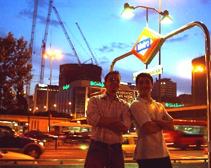

La historia del edificio Winsor ya es conocida por su desastre debido a un fallo u otras causas que han dado pie a hablar de conspiraciones...

Conspiraciones como la que ideamos hoy sobre cierto tapacubo que al final no llevamos a cabo (no puedo dar más pistas por temas legales).

Esto viene a raíz de un encuentro que tuvimos Smash, Ryf y un servidor en el centro de Madrid, por donde dimos un "largo" paseo y conocimos a Rafa, un personaje que no se dedica a la fotografía profesional.

En fín, un buen día por los momentos agradables que pasamos y por la buena evolución de la intervención que ha sufrido una persona muy cercana.

P.D. - Lo sé, parece un texto codificado por los rusos durante la Guerra Fría ;)
