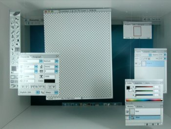

Me imagino que ha sido un trabajo realizado por estudiantes de diseño. Y lo que han dejado claro es que siempre encontramos formas diferentes de ver las cosas... Simplemente genial! <a href="http://www.hippocrit.com/GUI/index.html">Más capturas</a>.
