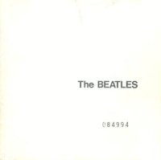

El otro día descubrí un álbum de los Beatles: 'The White Album'. No lo había escuchado antes porque, entre otras cosas, no me consideraba un fan acérrimo del grupo de Liverpol.

Anotar ante todo, que las canciones fluctúan entre varios estilos musicales, desde el rock hasta el pop, el blues, el country, incluso notas siniestras, música experimental, o algo mas heavy en una época en que el heavy aun no había nacido como movimiento musical.
Cada Beatle aportó sus propias canciones en una etapa en que el grupo ya estaba metido en problemas internos. Aun así, lograron hacer una obra maestra de la música, un disco que contiene casi todos los estilos habidos y por haber.

 Si algo caracterizó a los Beatles, y fue más acusada en su segunda etapa, sobre todo con el disco 'Revolver' en 1966 y posteriormente con su obra magna 'Sgt Pepper's Lonely Hearts Club Band ' en 1967, fue el de iniciar una revolucion musical que sin duda sin ellos, nunca hubiera pasado, y seguiriamos tan tranquilamente escuchando el simple rock and roll de los EEUU, o algo peor.
