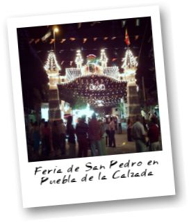

Ayer estuve en la feria. No faltaba nada: el barco pirata, autochoques, tómbolas, algodón de azúcar... y las casetas. En las caras de los niños se veia la ilusión y la emoción por montarse en las atracciones y los padres disfrutando incluso más que ellos, todo encajaba perfectamente.
Sobre las 2 a.m. se dió paso a una feria más adulta, los niños se marchaban a sus casas y sólo quedaban los "mayores". Ahí es cuando te das cuenta que la feria no es más que un traslado del botellón del fin de semana. Una de esas fiestas en las que todos son muy amigos pero apenas se conocen, donde prima la bebida y el "colegueo".
Supongo que todos tenemos derecho a divertirnos como queramos y que esto ha existido desde siempre, pero creo que ayer fué mi última noche de feria de la temporada veraniega.
