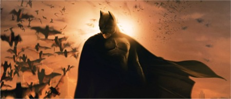

Tras un par de secuelas que no merecían llevar su nombre, Batman regresa a la escena con más fuerza que nunca.

Bruce Wayne ha sufrido numerosos lavados de cara a lo largo de su andadura, pero ha sido en la piel de Christian Bale donde el héroe trágico se muestra más humano. Todo lo humano que siempre debió ser. Ira, venganza, odio; debilidades que condicionan a todo ser humano, y los héroes lo son por encima de todo, al fin y al cabo.

Christopher Nolan estaba maravillado con el personaje, y lo demuestra ofreciéndonos una película completamente atípica, mucho más profunda a lo que una peli de superhéroes nos tiene acostumbrados. Un guión muy cuidado, dando prioridad a la personalidad y lo más hondo de la mente de Wayne antes que a la espectacularidad y las escenas de acción interminables que hay en otras películas. Y es que hasta bien pasada la mitad, el hombre murciélago no hace su majestuosa aparición.

Tim Burton nos ofreció una visión tan lúgubre y caótica de Gotham que se hace insuperable, aunque la recreación de la ciudad en esta nueva versión cumple su cometido con creces, mostrando los oscuros suburbios en contraste con la majestuosidad del centro de la ciudad. Pero hay algo que aporta esa oscuridad característica del universo de Batman: el miedo. Recreado de forma realmente original y sugerente. Porque no hay nada peor para tu enemigo que le provoques verdadero terror.

Un reparto inmejorable para la mejor película que se ha hecho sobre un héroe de comic. Sobre todo Bale, Michael Caine y, el siempre genial, Gary Oldman. Así como su banda sonora instrumental, oportuna y sin excesos, perfecta.

En definitiva, a mi me parece una película increíble, la mejor de la saga con diferencia y en la que se descubre al verdadero Batman, el vigilante nocturno de la ciudad de Gotham.
