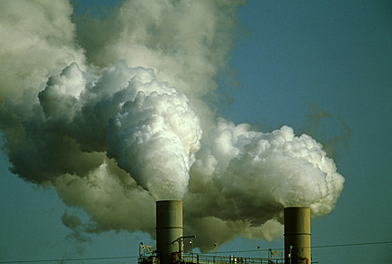

La Junta de Extremadura pretende autorizar la construcción de una refinería de petróleo en Extremadura, pasando por alto todas las ideas de desarrollo sostenible e hipotecando el futuro de una región que se caracteriza por su buen estado ambiental.

El problema de la refinería no es sólo que contamine. Si las leyes están bien hechas y se cumplen, no hay mucho que temer, pero el caso es que no me fío ni de una cosa ni de la otra, sobre todo de la segunda.

Luego está el hecho de cómo se plantea la refinería. Un particular dice que la quiere montar, y la Junta dice que le da tropecientos millones y que además la refinería se pone "por narices".

Además, ¿una refinería en medio de ningún sitio? ¿de dónde piensan traer el petróleo? ¿adónde piensan llevarlo? Seamos serios, Extremadura no es un centro ni de producción ni de consumo de petróleo.

Y ¿una nueva refinería en pleno siglo XXI? Pero si al petróleo le quedan 2 telediarios (o poco más). ¿Dónde está todo aquello del fomento de las energías renovables, del consumo responsable, del desarrollo sostenible...? Nada, nada... a montar un mamotreto en medio del campo.

Como digo, más que "no quiero humos en mi casa", el problema es que todo esto es una especie de antojo. Si se hubiera hecho un estudio para ver si realmente hace falta más capacidad de refino, si se hubiera llegado a la conclusión de que es preferible construir una nueva refinería antes que ampliar las existentes o simplemente importar productos, si se hubiera demostrado que la ubicación más lógica o la menos dañina es la propuesta, si se dieran garantías de que se cumplirán todos los requisitos ambientales... la cosa sería distinta. Pero mucho me temo que no ha sido así.

... y luego están las "sospechas fundadas de nepotismo"...

<a href="http://www.adenex.org/NOALAREFINERIA.htm">Más informacion</a>
