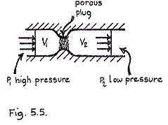

>Hoy, estimados lectores, hablaremos de un efecto físico, termodinámico para más señas, y sin embargo prometo no aburrirles. El efecto Joule-Thomson, también llamado efecto Joule-Kelvin, dice, básicamente, que la temperatura de un gas desciende si se lo somete a un descenso de presión. Este descenso de presión puede conseguirse, de entre otras muchas formas, haciendo pasar el gas a través de ua abertura estrecha.  
>
>¿Y para qué nos cuenta este plasta estas cosas? Con lo divertidos que eran los vídeos de los japoneses...- podrá preguntarse el lector. Pues resulta que es un efecto que todos conocemos pero sobre el que muy pocos se ponen a pensar. Les propongo un experimento:  
>
>Coloquen la mano frente a su boca, a unos 5 centímetros, y tomen mucho aire. Empiecen a echar aire sobre la mano, con la boca muy abierta al principio -lo que el vulgo llama "echar el aliento"- y vayan poco a poco cerrando los labios hasta terminar formando con ellos un estrecho orificio mientras siguen echando aire a la misma velocidad -lo que el vulgo llama "soplar". ¿Lo notan? El aliento está caliente, pero el soplido está frío (parezco Coco el de Barrio Sésamo). Al hacer pasar el aliento (inicialmente a temperatura corporal) a través de una abertura estrecha, sufre una compresión y descompresión que provocan el descenso de su temperatura. Ahora ya saben, estimados lectores, cómo funcionan muchos aires acondicionados.

Vía <a href="http://curiosoperoinutil.blogspot.com">CPI</a>.
