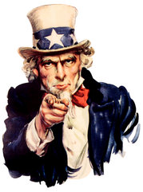

Siempre vemos a ese personaje pintoresco muy representativo de la cultura y vida de los Estados Unidos, pero sabes ¿quien era el <a href="http://en.wikipedia.org/wiki/Uncle_Sam">Tío Sam</a>?, ¿de dónde salió?. El hecho es que el tío Sam, auténtico símbolo de los estadounidenses, no tuvo precisamente lo que se puede decir un origen noble. Durante la segunda guerra entre los Estados Unidos y Gran Bretaña, en 1.812, Samuel Wilson, un inspector que aprovisionaba de carne al ejército, imprimió en los barriles de salazón las iniciales U.S., que significaban United States. Sin embargo, los soldados las interpretaron peyorativamente como uncle Sam -tío Sam-. A partir de entonces este personaje empieza a formar carta de naturaleza entre las gentes de la zona norte de Nueva York y Vermont que se oponían a la guerra. Por primera vez aparece en las páginas de un periódico en Troy, en el estado de Nueva York, en 1831. Tres años más tarde se publica un libro titulado precisamente Las aventuras del tío Sam. Poco a poco fue ganándose las simpatías del pueblo norteamericano, hasta que en 1961 el Congreso de los FE UU lo reconoce como símbolo nacional. Su traje repleto de barras y estrellas, se remonta a los años treinta del siglo pasado, tomando la imagen de las caricaturas que de Seba Smith, ensayista político de humor del momento, se hicieron en aquel entonces. Dan Rice, un célebre payaso, se encargó de popularizarlo a lo largo del siglo pasado. <a href="http://en.wikipedia.org/wiki/Uncle_Sam">Más del tío Sam</a>.

Vía <a href="http://en.wikipedia.org/wiki/Uncle_Sam">Wikipedia</a>.
