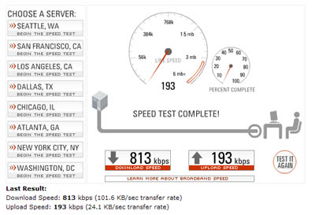

Hoy me ha dado por comprobar la velocidad de conexión de la ADSL teórica de 1Mb (de Telefónica). He hecho pruebas en diferentes medidores obteniendo resultados entre 800 y 1000 kbps. Más o menos lo que me esperaba.

Entre las diferentes pruebas, el test de velocidad que más me ha gustado ha sido el de <a href="http://www.speakeasy.net/speedtest/">Speakeasy</a>. Hace un test de descarga y subida, y además visualmente es muy atractivo (puedes incluso ver la velocidad en tiempo real durante la prueba).

Y a vosotros, ¿cuánto os da? ¿Cuánto os debería dar? ¿Con qué compañía?

