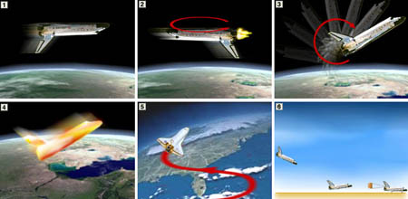

A raíz de un problema que se nos propuso en una asignatura sobre coetes químicos en la que habían varias posibles soluciones válidas, me dió por mirar cuál fué la que finalmente empleó la <a href="http://www.nasa.gov">Nasa</a>. No encontré lo que andaba buscando, pero me pareció bastante curioso este <a href="http://news.bbc.co.uk/1/hi/in_depth/4749393.stm">gráfico-resúmen de la BBC</a> en el que recalcan las diferentes fases del rápido desdenso de un transbordador.

Ésta es la traducción de las seis fases del descenso:

1. El transbordador orbita la Tierra boca abajo, para controlar la temperatura.
2. Para comenzar el descenso, el transbordador se gira de modo que se desplaza "hacia atrás", y enciende los motores durante unos pocos minutos para frenar su velocidad y caer de la órbita hacia la Tierra.
3. Tras finalizar el frenado y comenzar a descender, el transbordador vuelve a girar sobre si mismo para quedarse en un ángulo de unos 40º respecto a la horizontal de la superficie terrestre.
4. Esta orientación permite que las losetas térmicas aislantes encaren la atmósfera y la mayoría del calor - que llega a 1650ºC en los puntos más calientes del morro y las alas.
5. Una vez que pierde suficiente velocidad, la temperatura desciende y el transbordador comienza a volar como un avión estándar, usando su timón de cola y sus alerones para controlar el movimiento. Durante esta fase el transbordador se inclina abruptamente unas 4 veces de lado a lado para perder todavía más velocidad.
6. Finalmente, tras descender desde una altura de 360km y a velocidades de hasta Mach 30, el transbordador aterriza manteniendo una inclinación de unos 19º, bastante más que los aviones tradicionales. El aterrizaje se produce a casi medio mundo de distancia de donde comenzó el descenso.