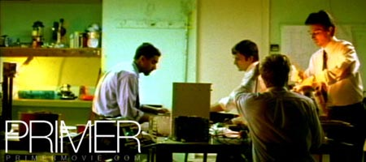

Ayer vi "Primer", una película de ciencia ficción hecha con apenas siete mil dólares, o, como a su director le gusta decir, &#8220;lo mismo que un coche usado&#8220;. Este es Shane Carruth, un ex ingeniero de 31 años que pasó tres aprendiendo cine de forma autodidacta.

En ella se cuenta la historia de dos ingenieros de garaje que en un experimento logran un hallazgo excepcional; la posibilidad de retroceder en el tiempo. Esto desata un torrente de posibilidades que apenas alcanzan a controlar, creando un nivel de paranoia que pone a prueba la confianza entre ambos.

La película es difícil de entender la primera vez que la ves, pues juega mucho con las líneas temporales; lo que habías visto una vez no era lo que pensabas al verla de nuevo. El puzzle puede ser difícil, pero es resoluble y merece la pena.

Para comprender mejor la historia dejo un <a href="http://www.freeweb.hu/neuwanstein/primer_timeline.jpg">esquema explicativo</a>, a mi me ayudó mucho ;) 
