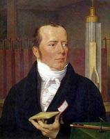

<b>Atención</b>: Posibles Spoilers de la serie. Lectura solo apta para los seguidores que hayan terminado de ver la segunda temporada y, además, hayan visto el video publicado en el juego "<a href="http://www.thelostexperience.com">The Lost Experience</a>" el pasado mes de septiembre. (<a href="http://www.youtube.com/watch?v=BdlhNEZkmgo">Aquí puedes ver la versión subtitulada del mismo</a>).

Una de las teorías más aceptadas hasta la fecha de lo que sucede en la isla de la famosa serie televisiva "Lost" (Perdidos), es la siguiente:

Hans Oersted descubrió el electromagnetismo en 1820.

En 1999 el satélite 'Oersted' fue lanzado con el propósito de registrar el campo magnético de la tierra. Los resultados condujeron a los científicos a creer que podría haber una inversión polar inminente de efectos devastadores: si la tierra perdiera su magnetosfera, sería vulnerable a la radiación masiva del espacio/sol. El satélite también reveló una anomalía en el campo magnético por debajo de Sudáfrica, señalando en dirección opuesta al resto del campo de la Tierra que ha ido aumentando durante centenares de años (puedes buscar más información en Google). Una idea similar también fue utilizada en la película 'El Núcleo'.

Hannes Alfvén: 

Su contribución a la ciencia, especialmente en el campo del electromagnetismo, revolucionó la forma en que los científicos veían el Universo, ganando un Premio Nobel a lo largo de su trayectoria. Hablaba inglés, alemán, francés, ruso y un poco de español y chino. También estudió filosofía oriental y religión. Pasó un tiempo en las Islas Fidji donde se fascinó con 'El Rayo Verde', un fenómeno que ocurre durante la puesta de sol. ¿Será coincidencia el cómic de Walt? 

También escribió la novela: 'La Gran Computadora: Una visión' (1968) que cuenta la historia de las computadoras que asumen el control el mundo (puedes buscar más info sobre Hannes Alfvén en Google).

Alfvén más Hans Oersted igual a: ALVAR HANSO

Éste es ALVAR HANSO, tal como se ve en la cinta de Dharma encontrada en la escotilla que abrieron los supervivientes:

Lo dicho anteriormente fue la razón para asumir el control de 'LA ISLA'.

Los científicos, temiendo los acontecimientos apocalípticos de una inversión polar, prepararon un ambiente para la supervivencia de la raza humana. Directa o indirectamente dirigido hacia cierta clase de personas que pudieran formar una comunidad para la supervivencia y la propagación de un mundo nuevo: carácteres sin figuras de padre/madre y/o carácteres con habilidades para la supervivencia: médicos, ingenieros, 'busca vidas', mercenarios, etc. y carácteres genéticos variados: africanos, caucásicos, asiáticos, etc. asegurando una población sana para futuras generaciones..

Entonces, en una isla que tenía ya una fuente natural masiva de electromagnetismo, construyeron una magnetosfera artificial, aludida en el comic de Walt y Hurley para rechazar los rayos cósmicos mortales que llegarían a la Tierra. La esperanza era que la comunidad pudiese prosperar, crecer y, eventualmente, repoblar y reconstruir el mundo.

La Iniciativa de Dharma de Alvar Hanso (si esto existe en la realidad de LOST) utilizó una tecnología basada en la remota visión del electromagnetismo para accionar esta magnetosfera y para influenciar las vidas de los candidatos futuros de la isla: los hechos extraños. Por ejemplo, cuando todos los candidatos estaban en posición, es decir en el avión, la conciencia colectiva "shockeó" y apabulló a cada uno de ellos. Los preservaron criogénicamente y desmontaron el avión, colocando sus fragmentos en el océano para asegurarse el veredicto de la muerte de todos ellos. Unos años más tarde, más fuselaje fue colocado en la playa con los pasajeros y, de esta manera, la escena fue recreada para dar la ilusión de que acababan de estrellarse. Entonces... EMPEZÓ TODO.

La contraseña/broma acerca del 'HOMBRE DE NIEVE', es una alusión a la criogenización.

La conciencia colectiva estropeó la navegación de este pájaro.

...Sayid le dice a Jack que la brújula está estropeada o el Norte se ha movido. En realidad se ha movido el Norte...

En uno de los episodios se observa que Walt se convierte en un experto lanzador de cuchillos, pero no. El metal del cuchillo es guiado por la conciencia colectiva para lograr que se acerque más a Locke: el más creyente servidor de la ISLA....

La presencia de este barco es una indicación de que esta isla ha sido siempre una fuente de gran energía magnética (la palabra "imán" viene de "magnesia", la tierra en donde la primera roca negra con poder de atracción fue encontrada). También es una indicación del pasado volcánico de la isla (empujándolo hacia arriba, tierra adentro). La lava se enfría para formar el basalto, el basalto se solidifica y adquiere el mismo campo magnético que la localización circundante, proporcionando así la información cronológica del campo magnético).

Las teorías de <a href="http://es.wikipedia.org/wiki/B.F._Skinner">B.F. Skinner</a> forman la base de los métodos usados por la conciencia colectiva para construir esta 'utopía social'. Estos son las voces en los árboles, las visiones, la niebla negra (metal conducido por un campo magnético), el monstruo (mecánico, pero diseñado para incorporar el miedo personal de cada superviviente). Utilizan cada truco psicológico de sus libros para manipular a los supervivientes y, así obtener la formación de una comunidad estable en la isla.

La imagen anterior es un ejemplo explícito de cómo la influencia de la conciencia colectiva de Dharma ha impregnado las vidas de los supervivientes: nótese el techo octagonal en la foto. 

La introducción de la mayoría de los episodios (el ojo abierto) establece que la voluntad principal del personaje percibe lo que desea mostrarle la conciencia colectiva. En un episodio, Boone tiene una epifánica visión de la conciencia colectiva... y muere al caer la avioneta de los narcotraficantes.

Locke camina pero no tiene ninguna sensación en sus piernas. La capacidad de Locke de caminar se basa en la voluntad de obedecer a la conciencia colectiva. Este nivel del obediencia se puede requerir a todos los supervivientes eventualmente. Sus piernas se mueven porque la conciencia colectiva permite que impulsos eléctricos minúsculos de su cerebro, a través de la espina dorsal, lleguen a los músculos de sus piernas.

<b>Para resumir</b>:

Los protagonistas nunca se estrellaron realmente: son el futuro de la humanidad, los supervivientes de un acontecimiento polar catastrófico, el cual ellos ignoran. Están en la isla para sobrevivir, procrearse y repoblar la Tierra. Ellos ignoran que este plan está sostenido por una sofisticada conciencia colectiva y un grupo de científicos usando energía electromágnetica con técnicas psicologicas de recompensa y castigo.
