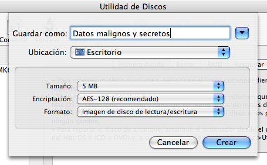
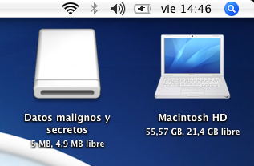
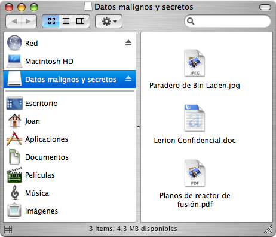
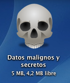

He encontrado por pura casualidad un <a href="http://www.macuarium.com/foro/index.php?showtopic=134751&hl=filevault">tutorial en el foro de Macuarium</a> realmente interesante para tener datos protegidos de lecturas indeseadas gracias a la <b>Utilidad de Discos</b> que nos proporciona Mac OS X. Ya aviso que la idea no es mía (ver enlace al foro), pero me ha parecido muy interesante compartirla:

<b>1.</b> Abrimos Utilidad de Discos (Aplicaciones>Utilidades) y pulsamos en <b>Nueva Imagen</b>. Nos tiene que aparecer algo así:

Le ponemos el nombre que queramos (algo que haga referencia a su contenido, como mi ejemplo) y el lugar donde queremos que se guarde el archivo .dmg. El <u>Tamaño</u> dependerá de lo que queramos proteger, en mi caso son simples documentos que podrían hundir imperios, asi que con 5 MB tendré mas que de sobra. Si lo que queréis almacenar son archivos grandes, pues más tamaño y listos. En <u>Encriptación</u> es importante poner AES-128. En <u>Formato</u> dejamos "Imagen de disco lectura/escritura". Cuando hayamos seleccionado todo pulsamos "Crear" y Utilidad de Discos nos pedirá la contraseña que queremos que tenga la imagen de disco. Podemos elegir que nos la recuerde, pero no tendría sentido porque cualquiera que use nuestro ordenador podría acceder a nuestro maligno contenido.

<b>2.</b> Ahora tenemos nuestro archivo .dmg donde dijeramos que lo guardase (en mi ejemplo, en el Escritorio), y en el Escritorio tenemos que tener montada nuestra imagen de ese disco .dmg:

<b>En esa imagen montada</b> es donde tenemos que meter los archivos que queremos proteger, simplemente arrastrándolos o copiándolos, quedándonos algo así:

<b>3.</b> Después, simplemente desmontamos la imagen del Escritorio, arrastrandola a la papelera o pulsando Cmd+E mientras está seleccionada. Cada vez que queramos acceder a nuestra pequeña caja de Pandora, ya sea para consultar la información o para añadir nuevos items, solo tenemos que ir a nuestro archivo .dmg y abrirlo. Obviamente nos solicitará la contraseña, así que <b>es importante que no la olvidéis o no podréis recuperar esos datos</b>.

Como toque personal podemos quitarle la extensión .dmg (<b>ojo</b>, sólo si tenéis desactivado Mostrar las extensiones de los archivos en las Preferencias del Finder) y también añadirle un icono mas descriptivo:

<a href="http://princesadelguisante.bitacoras.com/julio04/bricomania.jpg">Y eso es todo amigos</a>, ahora podemos guardar nuestros más preciados secretos sin temor a ser descubiertos.
