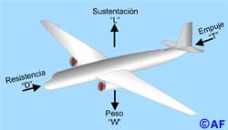
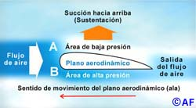
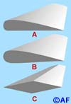
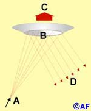

Partiendo de la <a href="http://www.lerion.com/blog/?p=192">entrada anterior</a>, me dediqué a recopilar algo de información sobre el tema. En primer lugar debemos tener claro cuáles son las fuerzas que actúan sobre un avión en vuelo:

<strong><u>Levantamiento o sustentación</u> (L).</strong> Es la fuerza de ascensión que permite al avión mantenerse en el aire. El levantamiento o sustentación se crea principalmente en las alas, la cola y, en menor cuantía, en el fuselaje o estructura. Para que el avión pueda volar la fuerza de sustentación debe igualar a su peso (L=W), contrarrestando así la fuerza de gravedad.

<strong> <u>Peso</u> (W).</strong> Es el resultado de la fuerza de atracción que ejerce la gravedad sobre todos los cuerpos situados sobre la superficie de la tierra, atrayéndolos hacia su centro. La fuerza de gravedad se opone al levantamiento o sustentación en el avión, tanto en tierra como durante el vuelo.

<strong> <u>Fuerza de empuje o tracción</u> (T).</strong> La proporciona el motor (o motores) del avión por medio de la hélice o por reacción a chorro. La fuerza de empuje permite al avión moverse a través de la masa de aire y es opuesta a la fuerza de resistencia. Para que el avión pueda mantenerse en vuelo la fuerza de empuje debe igualar a la fuerza de resistencia que se opone a su movimiento (T=D).

<strong> <u>Resistencia</u> (D).</strong> Es la fuerza que se opone al movimiento de los objetos sumergidos en un fluido. Desde el punto de vista físico, tanto el agua como los gases se consideran fluidos. De manera que el aire, al ser un gas, se considera también un fluido. La resistencia aerodinámica, que se opone al desplazamiento de los objetos cuando se desplazan a través de los fluidos, la produce la fricción y depende, en mayor o menor grado, de la forma y rugosidad que posea la superficie del objeto, así como de la densidad que posea el propio fluido.
<h3><strong>EL AIRE ES LA CLAVE</strong></h3>
La sustentación que mantiene al avión en el aire sólo se puede crear en presencia de un fluido, es decir, de la masa de aire que existe dentro de la atmósfera terrestre. Ni la sustentación ni la resistencia se producen en el vacío. Por esa razón las naves espaciales no necesitan alas para moverse en el espacio exterior donde no hay aire, con excepción de los transbordadores que sí la necesitan para maniobrar a partir del momento que reingresan en la atmósfera terrestre y después poder aterrizar.
<h3><strong>Teorías de Bernoulli y de Newton</strong></h3>

Existen dos teorías acerca de la creación de la sustentación: la de Bernoulli y la de Newton. Aunque ninguna de las dos se consideran perfectas, ayudan a comprender un fenómeno que para explicarlo de otra forma requeriría de una demostración matemática compleja.

<u><strong>Teoría de Bernoulli</strong></u>

La teoría del científico suizo Daniel Bernoulli (1700-1782), constituye una ayuda fundamental para comprender la mecánica del movimiento de los fluidos. Para explicar la creación de la fuerza de levantamiento o sustentación, Bernoulli relaciona el aumento de la velocidad del flujo del fluido con la disminución de presión y viceversa.

Según se desprende de ese planteamiento, cuando las partículas pertenecientes a la masa de un flujo de aire chocan contra el borde de ataque de un plano aerodinámico en movimiento, cuya superficie superior es curva y la inferior plana (como es el caso del ala de un avión), estas se separan. A partir del momento en que la masa de aire choca contra el borde de ataque de la superficie aerodinámica, unas partículas se mueven por encima del plano aerodinámico, mientras las otras lo hacen por debajo hasta, supuestamente, reencontrarse en el borde opuesto o de salida.

Teóricamente para que las partículas de aire que se mueven por la parte curva superior se reencuentren con las que se mueven en línea recta por debajo, deberán recorrer un camino más largo debido a la curvatura, por lo que tendrán que desarrollar una velocidad mayor para lograr reencontrarse. Esa diferencia de velocidad provoca que por encima del plano aerodinámico se origine un área de baja presión, mientras que por debajo aparecerá, de forma simultánea, un área de alta presión. Como resultado, estas diferencias de presiones por encima y por debajo de las superficies del plano aerodinámico provocan que la baja presión lo succione hacia arriba, creando una fuerza de levantamiento o sustentación. En el caso del avión, esa fuerza actuando principalmente en las alas, hace que una vez vencida la oposición que ejerce la fuerza de gravedad sobre éste, permita mantenerlo en el aire.

El teorema de Bernoulli es la explicación más comúnmente aceptada de cómo se crea la sustentación para que el avión se mantenga en el aire. Sin embargo esa teoría no es completamente cierta, pues si así fuera ningún avión pudiera volar de cabeza como lo hacen los cazas militares y los aviones de acrobacia aérea, ya que al volar de forma invertida no se crearía la fuerza de sustentación necesaria para mantenerlo en el aire al variar la forma de las alas. De hecho, las alas de esos tipos de aviones son simétricas por ambos lados.

Secciones transversales de tres tipos diferentes de alas: (A) ala estándar. (B) perfil típico del ala de un avión de acrobacia aérea. (C) ala de un caza de combate. Observe que ni el ala ?B? ni la ?C? son planas por debajo.

De cualquier forma la teoría de Bernoulli no es desacertada por completo, pues en realidad durante el vuelo de un avión el aire siempre se mueve más rápido por la parte de arriba que por la de abajo del ala, independientemente de la forma de su sección transversal. Como postula en parte el teorema, esa diferencia de velocidad origina una baja presión encima del ala que la succiona hacia arriba y, por tanto, crea la sustentación. Sin embargo, contrariamente a esa teoría, las partículas que viajan por arriba de un plano aerodinámico nunca se llegan a reencontrar con las que viajan por debajo.

<u><strong>Teoría de Newton</strong></u>

Por su parte, el matemático y físico inglés Sir Isaac Newton (1642-1727) planteaba que las moléculas de aire actuaban de forma similar a como lo hacen otras partículas. De ahí se desprende que, las partículas de aire al golpear la parte inferior de una superficie aerodinámica deben producir el mismo efecto que si disparamos una carga de perdigones al fondo de un plato o disco irrompible. De es forma parte de su velocidad la transferirían al plato, éste se elevaría y los perdigones rebotarían después de hacer impacto. Newton quería demostrar con esa experiencia que las partículas de aire actuaban de forma similar a como lo harían los perdigones, pues al chocar éstas con la parte de abajo de una superficie aerodinámica, le transfieren velocidad empujándola hacia arriba.

Representación gráfica de la teoría de Newton: (A) Disparo de perdigones. (B) Impacto en el fondo de un plato o disco irrompible. (C) La velocidad que transfieren los perdigones al plato o disco hace que éste se eleve. (D) Los perdigones rebotan y caen después del impacto.

Esta teoría de Newton tampoco es completamente exacta, pues no tiene en cuenta la función que tiene la superficie superior del plano aerodinámico para crear la sustentación. Sin embargo, para condiciones de vuelo hipersónicas, que superen en cinco veces la velocidad del sonido y en densidades del aire muy bajas, la teoría de Newton sí se cumple, pues esas son, precisamente, las condiciones a las que se enfrentan los transbordadores en el espacio antes de reingresar en la atmósfera terrestre.

En relación con el teorema de Bernoulli y la teoría de Newton lo importante es comprender que la creación de la sustentación dentro de la atmósfera terrestre depende tanto de la superficie de arriba como la de abajo del ala y de las diferentes áreas de presiones que se crean. A pesar de que ninguna de las dos teorías se pueden considerar completamente perfectas ayudan, no obstante, a comprender el fenómeno de cómo se crea la sustentación que permite a los aviones mantenerse en el aire.
