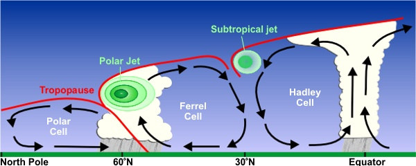
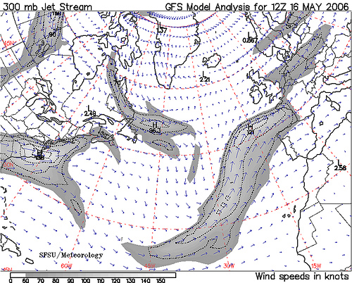

Más sobre aviones...

Si consultáis un vuelo de vacaciones Madrid ? La Habana os encontrareis que el vuelo de ida son 9:25 horas y el de vuelta 8:55 horas. ¿Una conspiración de Iberia para estropear el regreso de vacaciones? Puede que no, porque el vuelo Frankfurt - Miami con Lufthansa dura 9:40 horas para la ida y solo 8:45 horas para el regreso. Aun peor ¿A que se debe esta diferencia?

A pesar de las quejas sobre retrasos, largos tiempos de espera e incomodidades varias todos tenemos la impresión de que el transporte aéreo, gracias a la moderna tecnología, esta a salvo de los caprichos de la naturaleza. Pero eso es falso. La velocidad de un avión se mide con respecto al aire que le rodea y no con relación al suelo. Eso por esto que los aeropuertos tienden a orientarse según los vientos dominantes para facilitar los despegues y aterrizajes.

Una vez en el aire, el viento sigue influyendo porque cada avión tiene unos parámetros ideales de consumo y altura de vuelo que depende de su velocidad, con respecto al aire. La diferencia no suele ser grande en general aunque si existe un caso donde es importante.

La corriente de chorro (<a href="http://en.wikipedia.org/wiki/Jet_stream">Jet-Stream</a>) es un flujo de aire a gran altura generado por las diferencias de temperatura en distintas zonas del globo terrestre. El aire se calienta en el ecuador y se enfría en los polos generando movimientos a nivel planetario. En el siguiente gráfico del servicio de meteorología del EE.UU. podemos ver como se forma:

El giro del planeta hace que las corrientes se curven como podemos ver en un huracán, es el conocido <a href="http://es.wikipedia.org/wiki/Fuerza_de_Coriolis">efecto de Coriolis</a>. El resultado final, en el Atlántico Norte, es un viento que sopla de oeste hacia el este con una velocidad entre 55 y 120 km/hora con picos de hasta 400 km/h. Esto provoca el retraso del avión cuando vuela hacia el oeste. En otras rutas los efectos pueden ser diferentes. El grafico inferior es regenerado cada seis horas por la Universidad de San Francisco y recoge la distribución de los vientos el Atlántico Norte.

Esto significa que, manteniendo la velocidad con respecto al aire, la velocidad respecto al suelo puede ser muy diferente. Y esta diferencia es la que explica la diferente duración de los vuelos. Hay tanta energía que es una pena desperdiciarla. Aprovecharla es difícil aunque no es imposible. Hay una empresa  <a href="http://www.skywindpower.com/ww/index.htm">Skywindpower</a> que esta desarrollando un invento australiano, un artefacto capaz de sostenerse en el aire frente al viento y extraer energía del flujo de aire. Un cruce entre cometa y helicóptero que además generaría energía. Quien sabe, tal vez lo consigan.
