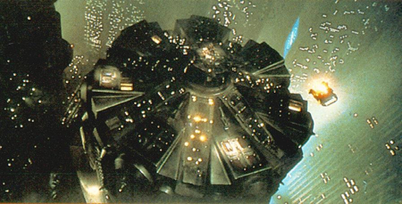

Hacer el comentario de una película es siempre algo complicado, pero si se trata de <b><i>Blade Runner</i></b> la dificultad se eleva a niveles insospechados. Pero pocas son las obras que albergan tantas lecturas, y que han influido tanto en el cine tal y como lo conocemos hoy, como la obra maestra de <b>Ridley Scott</b>.

Y es que <i>Blade Runner</i> supuso la consagración de la ciencia ficción en el cine, además de desterrar la imagen de género infantil y aventurero que se había ganado con películas como <i>La guerra de las Galaxias</i>. La película está basada en la novela <i>¿Sueñan los androides con ovejas eléctricas?</i> de <b>Phillip K. Dick</b>, uno de los autores mas consagrados de la literatura de ciencia ficción, que murió poco antes del estreno de la película. Como curiosidad, los ojos de la industria cinematográfica se posaron sobre la obra de Dick después del éxito de <i>Blade Runner</i> y varias han sido las películas basadas en sus novelas. Aunque ninguna se acerca a la calidad expuesta en <i>Blade Runner</i>, y es que esta última forma parte del prestigioso y exclusivo grupo de películas que han sido capaces de superar a su homónimo en papel. Vamos, que <i>Blade Runner</i> va a tomar té y pastas los domingos con películas del calibre de <i>La naranja mecánica</i> o <i>El Padrino</i>, y no penséis que hay muchas más.

Pero olvidemos por un momento la magnificiencia de la película para centrarnos en su historia: <b>Los Angeles, 2019</b>, la Tierra esta al borde de la devastación, las guerras de los hombres y la contaminación han llevado a la humanidad a buscar alternativas y la colonización espacial es un hecho. La búsqueda de los planetas, así como el posterior asentamiento, son tareas demasiado peligrosas para los seres humanos, así que son realizadas por replicantes: seres desarrollados genéticamente, compuestos completamente de sustancias orgánicas. Recientemente la Tyrell Corporation presentó el modelo Nexus6, replicantes prácticamente perfectos: más fuertes, más rápidos y al menos tan inteligentes como los ingenieros que los desarrollaron, como reza el prólogo de la película.

Los replicantes tienen una fecha de caducidad asignada de 4 años como sistema de seguridad. Además, se les oculta su verdadera naturaleza implantándoles falsos recuerdos de infancia y juventud. Si el lector descubriese que todo lo que cree que ha sido su vida han sido meros recuerdos falsos y que además le queda muy poco tiempo antes de morir, ¿cómo se sentiría?

Decía Marx que un obrero no se rebelaría hasta que no fuera capaz de distinguir las clases sociales y su posición en ellas, y eso es lo que descubren un grupo de replicantes que se amotinan y logran llegar a la Tierra a conocer a su creador para intercambiar algunas palabras con él. Pero los replicantes son ilegales en la Tierra, excepto en las fabricas destinadas a su producción, y el ex-detective y ex-blade runner Rick Deckard es llamado para retirar a este pequeño grupo de replicantes.

Adentrándonos en el lado técnico, la película fue dirigida por Ridley Scott, al que ahora se le conoce coloquialmente como"el director de <i>Gladiator</i>", y <i>Blade Runner</i> supuso su consagración como director después de la también estupenda <i>Alien: el 8ª pasajero</i>. Las malas lenguas hablan de que un primo suyo debió dirigir estas dos películas, ya que desde entonces el bueno de Ridley sólo ha sido capaz de obsequiarnos con peliculones como <i>Black Hawk</i>, <i>Legend</i>, <i>El reino de los cielos</i>? todas ellas muy por debajo de esas dos. Incluso <i>Gladiator</i> palidece al lado de ellas. El reparto lo componen Harrison Ford (Rick Deckard), Sean Young (Rachael), Rutger Hauer (Roy Batty), y Daryl Hannah (Pris) entre otros, y la fantástica banda sonora fue compuesta por Vangelis

El lema de Tyrell Corporation es "Mas Humanos que los Humanos" y la película, en una primera aproximación, gira entorno a esta idea: <b>¿Qué significa en realidad ser humano?</b> Los replicantes son capaces de sentir miedo, amor, odio? son capaces de razonar y de ansiar una libertad negada antes incluso de ser creados, y parecen comprender mejor el concepto de vida que los propios seres humanos.

<b>¿Cuáles son las consecuencias morales de crear algo tan perfecto?</b> Las medidas de limitar las funciones vitales de los replicantes a 4 años pueden parecer razonables si tenemos en cuenta la posible amenaza que supondría para la raza humana, pero las similitudes con la esclavitud son cada vez mayores. <b>¿Por qué tenemos miedo a los replicantes?</b> Existe una teoría real formulada por un ingeniero de cibernética japonés llamada <a href="http://es.wikipedia.org/wiki/Valle_Inexplicable">Teoría del Valle Inexplicable</a>, donde se expone que un androide con apariencia semi-humana provocará una reacción agradable al ojo humano, pero aquel androide que sea completamente similar a un humano solo provocará rechazo entre nosotros. Es decir, hay un límite dentro de la apariencia externa de los androides a partir de la cual solo conseguirá infundir miedo. En todo caso, esto es tan solo una teoría y no es ni mucho menos unánime dentro de la comunidad científica.

Merece la pena reseñar el encuentro entre Roy Batty y su creador, donde el replicante condena a muerte al presidente de Tyrell Corporation por limitarle la vida a tan solo 4 años. Los espectadores solemos mostrar cierta simpatía hacía los replicantes, igual que la manifestamos hacia Frankenstein, ya que ambos son meras creaciones de un inventor cruel, buenas por naturaleza pero que muestran su lado mas amargo cuando les rechaza la sociedad. <b>¿Podemos nosotros condenar a nuestro Creador (si creemos en uno) por condenarnos a muerte al nacer?</b>.

Por último, pero no por ello menos importante, queda uno de los debates que más ha dado que hablar entre los aficionados al cine: <b>¿Es Deckard un replicante?</b> Muchos son los argumentos que ayudan a reforzar ambas teorías. En la novela original, Deckard era indiscutiblemente humano, Ridley Scott ha admitido que su intención era mostrar al detective como un replicante, Harrison Ford nunca estuvo de acuerdo con esta idea y muchas veces ha hablado de que interpretó a su personaje como un humano, y uno de los guionistas de la película, Hampton Fancher, no ha dudado en reconocer que escribió la película pensando en Deckard como un humano más.

Siendo que no hay unanimidad dentro del propio equipo técnico y artístico, no es de extrañar las incongruencias acerca de la verdadera naturaleza de Deckard, aun así hay ciertos detalles que decantan la balanza a favor de que sea un replicante. En todo caso, esta ambigüedad es, entre otras, una de las razones que explican la magia de Blade Runner, incluso ahora que falta tan poco para el 25 aniversario de su estreno.

<b>Información obtenida en:</b>
- <a href="http://www.microsiervos.com/archivo/peliculas-tv/blade-runner.html">Blade Runner en Microsiervos: Pelicula #1 Top Geek.</a>
- <a href="http://es.wikipedia.org/wiki/Blade_Runner">Wikipedia</a>
- <a href="http://www.geocities.com/Hollywood/Boulevard/7920/">Jack Blade Runner Page</a>
- y de <a href="http://www.google.com/search?hl=es&client=safari&rls=es&q=%22blade+runner%22&btnG=Búsqueda&lr=lang_es">otros muchos lugares</a> de los que he perdido la pista entre anotaciones :(.
