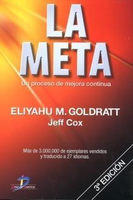

<b>Título: </b><a href="http://www.elcorteingles.es/libros/producto/libro_descripcion.asp?CODIISBN=847978718X">La Meta</a>
<b>Autor: </b>Eliyahu Goldratt
<b>Tema: </b>Novela Empresarial
<b>Editorial: </b>Díaz de Santos, 2005
<b>Fecha de publicación: </b>1984
<b>Páginas: </b>402
<b>ISBN: </b>847978718X
<b>Idioma: </b>Castellano
<b>Título original: </b>The Goal

Todo un clásico, una de las obras (por no decir la que más) prestigio goza en el campo empresarial. Empecé a leer este libro sin esperar gran cosa, pensé que sería un tostón pero desde el principio se hace muy ameno. Está destinado principalmente a los directivos de empresa, aquellas personas que toman decisiones importantes al cabo del día, que tienen que planificar el funcionamiento de sus negocios y en ocasiones adelantarse al futuro para evitar sucesos desagradables. 

Sinopsis:
<blockquote>Escrita con un estilo de relato de acción, La Meta es la emocionante novela que está transformando el pensamiento de los directivos de todo el mundo occidental. Alex Rogo es un 'estresado' director de fábrica que intenta desesperadamente mejorar los resultados de la misma, que está abocada al desastre. Lo mismo ocurre con su matrimonio. Tiene noventa días para salvar su fábrica, o esta será cerrada por la corporación, lo que conllevará la pérdida de cientos de puestos de trabajo.</blockquote>
