<a href="http://maps.google.com/maps?t=k&q=29.280278,-82.124722&amp;amp;amp;amp;amp;amp;amp;ie=UTF8&z=18&ll=29.278101,-82.115968&spn=0.00189,0.005375&om=1">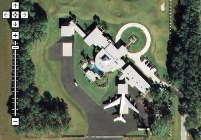</a>

Situada en una lujosa urbanización de Florida, la mansión de John Travolta alberga cuatro jets privados y un Boeing 707 que el actor aparca en el garaje. La casa pertenece al complejo de Jumbolair, una urbanización donde los propietarios disponen de una pista de aterrizaje para su uso particular. Aunque parezca increíble, el caso de Jumbolair está empezando a dejar de ser una excepción, y en los últimos años han proliferado decenas de urbanizaciones de este tipo en Estados Unidos, complejos donde los propietarios disponen de sus avionetas para viajar libremente cuando y donde quieran. Éste es un breve repaso a tan particular forma de vida. 

<strong>1. Jumbolair y la casa de los Travolta</strong>

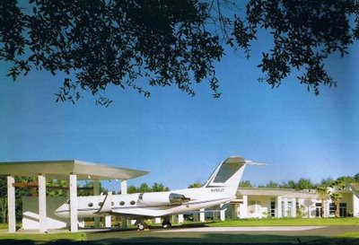

La urbanización Jumbolair fue levantada hace unos años por el excéntrico millonario Arthur Jones, quien decidió construir un paraíso para los amantes de la aviación. En sus más de dos millones de metros cuadrados, Jumbolair alberga a 125 familias y una pista de 2.200 metros para que puedan ir y venir con sus aviones.

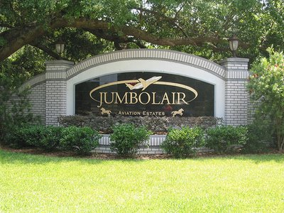

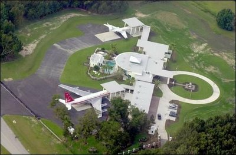

El más insigne vecino de Jumbolair, el actor John Travolta, se instaló aquí hace unos años y mandó construir una casa con varios hangares privados. En ellos alberga el Boeing 707 que le compró a la compañía australiana Qantas y que utiliza para viajar por todo el mundo.

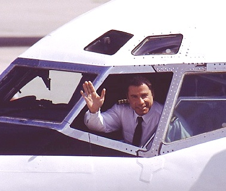

Travolta es un piloto cualificado, tiene diversas licencias, entre las que se cuenta la de piloto comercial, pero incluso entre los amantes de la aviación es considerado como un excéntrico. Su mansión no solo alberga cinco aviones sino que consta de su propia torre de control.

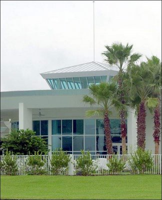

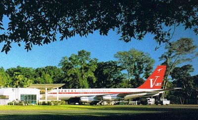

Además, Travolta dispone de una tripulación de seis personas a las que viste con uniformes azules y una gorrita blanca. En el año 1999 se vio obligado a realizar un aterrizaje forzoso en el Aeropuerto Internacional de Logan, Boston, por culpa de un motor sobrecalentado.

<strong>2. Un avión en cada garaje</strong>

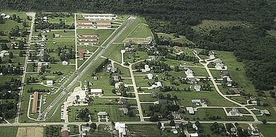

Sin embargo, el sueño de vivir junto a tu avión está dejando poco a poco de ser un privilegio de multimillonarios como Travolta. Según un estudio de la Asociación "Living With Your Plane", en Estados Unidos existen alrededor de 430 urbanizaciones con aeropuerto propio, en las que se contabilizan más de 22.000 viviendas. Un vistazo a través de Google Maps a urbanizaciones como el "Cameron Airpark", de California, nos permiten observar decenas de casas con avionetas en lugar de coches en la puerta de los garajes.

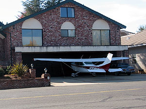

En muchas de estas urbanizaciones las carreteras son de doble uso y pueden ser transitadas tanto por coches como por aeronaves. No se conocen accidentes importantes, salvo el de un chico que se mató en Chicago tras chocar con su bicicleta contra un avión.

<a href="http://maps.google.com/maps?q=38.676521,-120.989406&ie=UTF8&amp;amp;amp;amp;amp;amp;amp;amp;t=k&om=1&z=19&ll=38.685051,-120.991426&spn=0.000812,0.002688">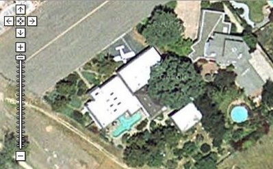</a>

Generalmente, el propietario conduce la avioneta desde la puerta de su casa hasta la pista principal y desde allí despega hacia su destino sin mayor dificultad. En muchos casos, como el de la urbanización californiana de Cameron, los residentes se permiten el lujo de acudir a su trabajo volando.

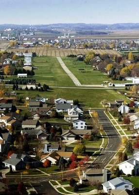

La mayoría de estas comunidades están situadas en los estados del sur, donde hace mejor tiempo, y en lugares apartados de las ciudades. Algunas se sitúan junto a aeródromos públicos donde los no residentes pueden hacer uso de la pista, aunque otras muchas solo permiten el aterrizaje y despegue de los vecinos de la urbanización.

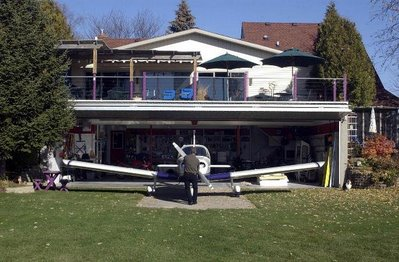

Desde los atentados del 11-S, las cosas se han puesto mucho más duras para este tipo de instalaciones y las autoridades han puesto algunas restricciones. Los residentes argumentan que no hay nada tan seguro como conocer a tu propio vecino.

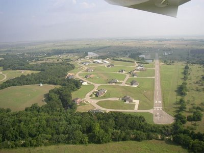

<a href="http://googlesightseeing.com/maps?p=&c=&amp;amp;t=k&hl=en&ll=33.171329,-97.049462&z=18">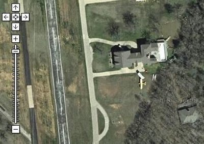</a>

Poder volar a cualquier lugar en cualquier momento es una sensación liberadora - explican algunos de los propietarios. Muchas de las personas que viven en estas urbanizaciones son pilotos profesionales que trabajan para grandes compañías, pero también hay aficionados que se han sacado la licencia de pilotos. El alquiler de una casa en uno de estos complejos supera los 100.000 dólares al año, un precio que - si lo tuviéramos - muchos estaríamos dispuestos a pagar solo por conocer la sensación de libertad que proporciona.

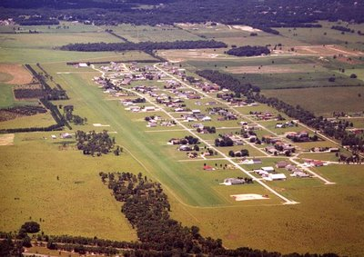

<a href="http://maps.google.com/maps?q=38.676521,-120.989406&ie=UTF8&amp;amp;amp;amp;amp;amp;amp;amp;z=18&ll=38.681368,-120.989642&spn=0.001625,0.005375&t=k&om=1">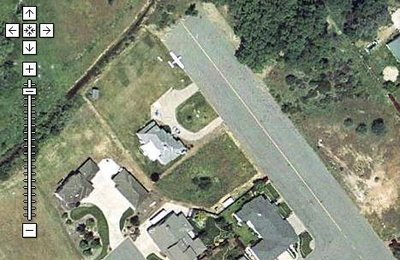
</a>

Ver: Proyecto de un Airpark en Murcia (España): <a href="http://www.globalcosta.com/airpark/spanish/airpark.htm">1</a> y <a href="http://www.laeconomia.com/noticia.asp?id=294&numero=84">2</a>

(Via <a href="http://fogonazos.blogspot.com">Fogonazos</a>)
