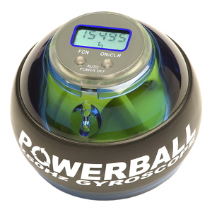

Para la gente que no conozca el concepto de gadget aquí va la definición según la <a href="http://es.wikipedia.org/wiki/Portada">wikipedia</a>:

<blockquote>Un gadget o gizmo es un dispositivo que tiene un propósito y una función específicos, generalmente de pequeñas proporciones, práctico y a la vez novedoso. Los Gadgets tienden a ser inusuales con tecnología punta.

Se suele pensar que la palabra fue inventada, alrededor de la década de 1980 en Estados Unidos, pero en realidad su acuñación se retrocede a los años 1884-5 la compañía Gaget, Gauthier & Cie, encargada de la fundición de la Estatua de la Libertad, al acercarse la fecha de la inauguración quería algo de publicidad, y comenzó a vender réplicas en pequeña escala de la famosa dama.

La primera bomba atómica fue llamada gadget por los científicos del Proyecto Manhattan, al ser experimentada en la Prueba Trinity.

En ficción, son populares en las películas de espías, especialmente en las series de James Bond o en las series de Batman y Iron Man, dependientes siempre de sus equipos. Otro personaje célebre de los dibujos animados dotado de un surtido de gadgets, era el Inspector Gadget.</blockquote>

El otro día, gracias a un amigo, descubrí mi más reciente "adquisición gadgetiana", el <a href="http://www.powerballs.com/">Powerball</a>.

PowerBall ha sido desarrollado en los Estados Unidos a petición de la NASA. Como los astronautas no pueden entrenarse con pesas en situación de ingravidez, se requería un dispositivo de ejercicio que también pudiera utilizarse en el espacio. Las teorías científicas más recientes en el terreno de la terapia motora han permitido desarrollar el PowerBall. Al contrario que otros aparatos, el PowerBall no funciona con pesos fijos sino gracias al principio de la fuerza centrífuga.

Por ello, la fuerza del PowerBall es variable y se ajusta al estado de forma del usuario. La fuerza centrífuga generada puede ascender hasta aprox. 15 kg a 10.000 revoluciones por minuto.

Pues bien, mañana lunes recibo el modelo "Regular" con cuentarevoluciones electrónico. Os mantendré informados.

Más info: <a href="http://www.powerball.es">Powerball Spain</a>
