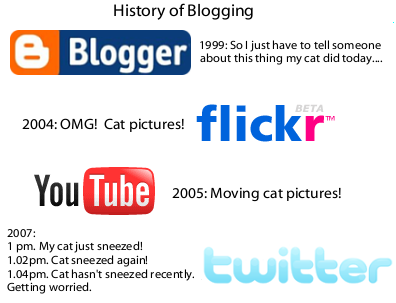

Evolución del blogging que he encontrado vía <a href="http://www.nuncajamas.com/">Nunca Jamás</a>. En castellano sería algo así:

* 1999 [Blogger]: Tengo que contarle a alguien lo que ha hecho mi gato hoy...
* 2004 [Flickr]: ¡Mola! ¡fotos de mi gato!
* 2005 [YouTube]: ¡Videos de mi gato!
* 2007 [Twitter]:  

  * 13h, mi gato ha estornudado.
  * 13h02m, mi gato a vuelto a estornudar.
  * 13h04m, Mi gato lleva un rato sin estornudar y me empieza a preocupar.

Desde luego que el fenómeno <a href="http://www.twitter.com">twitter</a> está condenado al éxito. Tanto que no sé si acabará muriendo de él...

<blockquote>Twitter es el reality show hecho 2.0</blockquote>

Yo estoy en <a href="http://twitter.com/ryf">matrix</a>, ¿y tu?

<strong>Actualización:</strong> Ya están integradas nuestras cuentas Twitter en el blog (abajo a la derecha), si quereis apacerer sólo teneis que crear una y añadirnos como "friends".
