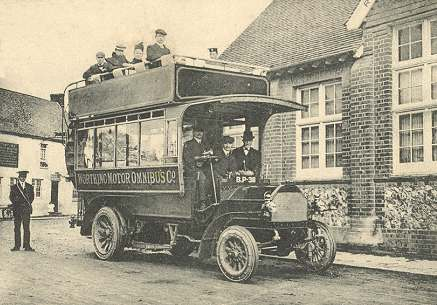

Dos ómnibus salen al mismo tiempo de Mende y de Alès, cada uno a una velocidad uniforme pero uno marcha más lentamente que el otro. Se cruzan a 28,8 kilómetros de la ciudad que se encuentra más próxima. Llegados a su destino, los ómnibus estacionan una media hora para permitir el cambio de pasajeros, después vuelven a partir en sentido inverso: el de Mende vuelve a Mende y el de Alès vuelve a Alès. Se cruzan a 14,4 kilómetros de la ciudad que se encuentra entonces más próxima.
¿Cuál es la distancia que hay entre las dos ciudades?

(El resultado puede obtenerse mediante dos operaciones elementales)
