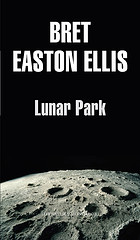

<b>Título: </b><a href="http://www.elcorteingles.es/libros/producto/libro_descripcion.asp?CODIISBN=6520377620">Lunar Park</a>
<b>Autor: </b>Bret Easton Ellis
<b>Tema: </b>Novela política
<b>Editorial: </b>Ediciones debolsillo
<b>Páginas: </b>384
<b>ISBN: </b>8483461587
<b>Idioma: </b>Castellano

Easton Ellis está reconocido como uno de los mejores escritores norteamericanos del momento. El libro transcurre en un ambiente con situaciones surrealistas, casi sobrenaturales. Pero eso no es lo más importante, sino que en realidad es un libro de relaciones paterno-filiares, más o menos autobiográfico y una crítica a la sociedad más rica y pija norteamericana.

Un libro entretenido y <strong>muy recomendable</strong>.

Sinopsis:
<blockquote>El autor de American Psycho lleva a cabo, en esta historia sobre una familia de clase alta, un ejercicio de sinceridad -y a la vez de fabulación- deslumbrante. Encarada en principio como relato autobiográfico, el principal escenario de Lunar Park es una casa encantada en donde ocurren hechos escalofriantes. Esta es, también, la historia de un hombre que busca su redención.</blockquote>
