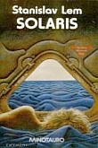

Título: <a href="http://www.elcorteingles.es/libros/producto/libro_descripcion.asp?CODIISBN=8445074407">Solaris</a>
Autor: Stanislaw Lem
Tema: Ciencia Ficción
Publicaci&oacute;n: 1961
Editorial: Minotauro
Páginas: 236
ISBN: 8445074407
Idioma: Castellano

Este libro hay que leerlo guste o no la ciencia ficción ya que resuelve pocas dudas y crea un mar de ellas. ¿Cuáles son los límites del hombre? ¿Existe una realidad objetiva o la realidad depende de como la perciba cada individuo?, ¿Puede el ser humano discernir el universo sin una visión antropomórfica?, ¿puede existir un dios imperfecto, evolutivo, amoral?, ¿Somos realmente individuos únicos, imposibles de calcar?, ¿Cómo hemos podido avanzar tanto sin llegar a conocernos primero?

Un libro para reflexionar, muy fácil de leer e increíblemente ligero.

Sinopsis:
<blockquote>El científico/astronauta Kris Kelvin llega a la Estación Espacial Solaris, que estudia desde hace mucho tiempo el planeta del mismo nombre, una enorme y enigmática bola recubierta casi por entero por un "mar", que orbita en torno a dos soles distintos desafiando todas las leyes de la física y sobre cuya estructura, composición y funciones se han escrito innumerables teorías, todas sin probar. Al poco de la llegada a la estación empiezan a ocurrir fenómenos extraños, el más importante de los cuales es la reaparición física de la esposa de Kelvin, muerta hace ya varios años. El resto de los científicos residentes en la estación también se comporta de manera anormal...</blockquote>
