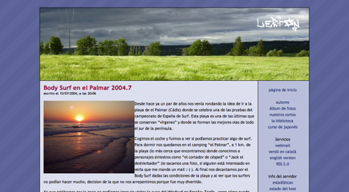
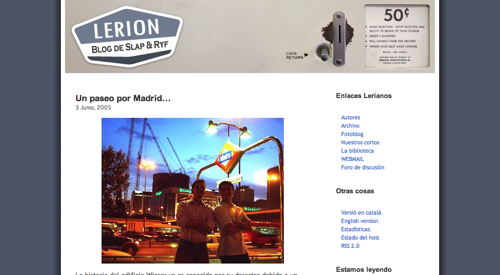
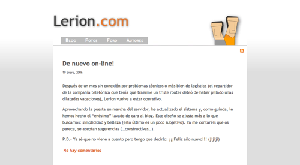
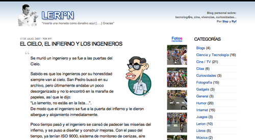
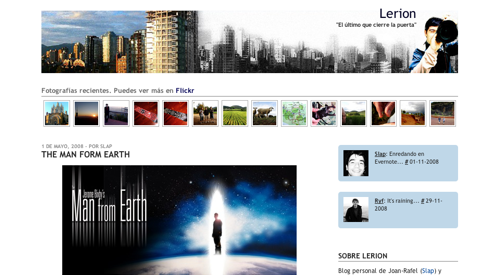
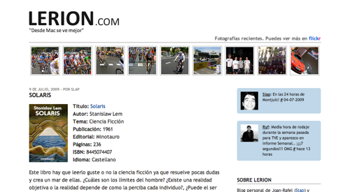

Hace tiempo que quería escribir esta entrada. El otro día, haciendo una copia de seguridad, encontré los antiguos diseños de Lerion y me hizo tanta ilusión verlos que los he restaurado y he realizado capturas de pantalla para poder ver cómo ha ido evolucionando el blog. Seguro que algunos los recordaréis.
&nbsp;

<strong>Primera versión. Año 2004.</strong> Así empezó el blog, muy colorido.
&nbsp;

<strong>Segunda versión. Año 2005.</strong> Un diseño un poco más sobrio y con fondos blancos para integrar mejor las imágenes.
&nbsp;

<strong>Tercera versión. Año 2006.</strong> Se dio un giro hacia el minimalismo, eliminando secciones y centrándose sólo en el blog personal.
&nbsp;

<strong>Cuarta versión. Año 2007.</strong> Este diseño se ideó pensando en la funcionalidad y accesibilidad. Se muestra todo el blog en la página principal, eliminando todas las subpáginas, con fuentes grandes y fáciles de leer. Además, se integra la cuenta flickr y vimeo (fotos y videos) mostrando las últimas actualizaciones de forma intuitiva. Este diseño ha representado la base y la personalidad de todos los rediseños posteriores.
&nbsp;

<strong>Quinta versión. Año 2008.</strong> Se añade la integración con Twitter y se modifica la estructura de la fotos para que se vean todas a la vez ya que se actualizan con más asiduidad.
&nbsp;

<strong>Versión 5.1. Año 2009.</strong> Se aumenta el tamaño de las fotos del flickr para que sean más fáciles de ver y se le da un toque más serio al título para que no quite protagonismo al resto del blog. Todos estos cambios están orientados a que sea más fácil y cómodo de leer.

Estoy preparando otra entrada con todo el material online de la era "pre-lerion" (Slap&Reef, Heptagon.d2g.com, ClanKRS, QKI, etc.). Se trata de la primeras páginas que realizamos desde el 1998 hasta el 2004. Sí, sí... Época de Geocities y gifs animados!

