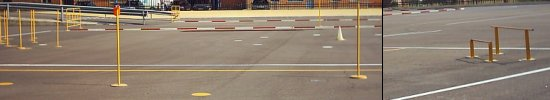

 Después de un mes sin publicar noticias por culpa de los exámenes... buena excusa ehh? Por fin nos hemos podido presentar al exámen práctico de la moto y... ¡¡Lo hemos conseguido!!, con esto se demuestra que sin haber llevado nunca una moto de marchas y con sólo una clase práctica (y un poco de suerte) se puede aprobar.
El circuito parece más fácil de lo que es, además tener que llevar la moto casi todo el tiempo en primera y a medio embrague es muy fastidioso, sobretodo si el embrague va un poco duro y tienes que dar más vueltas que una noria. Pero bueno... ya tenemos el A!!!
