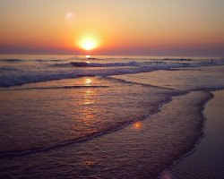

Desde hace ya un par de años nos venía rondando la idea de ir a la playa de el Palmar (Cádiz)  donde se celebra una de las pruebas del campeonato de España de Surf. Esta playa es una de las últimas que se conservan "vírgenes" y donde se forman las mejores olas de todo el sur de la península.

Cogimos el coche y fuimos a ver si podíamos practicar algo de surf. Para dormir nos quedamos en el camping "el Palmar", a 1 km. de la playa (lo más cerca que encontramos) donde conocimos a personajes siniestros como "el cortador de césped" o "Jack el deshierbador" (le sacamos una foto, si alguien está interesado en verla que me mande un mail :-) ). Al final nos decantamos por el Body Surf dadas las condiciones de la playa y al ver que los surfers no podían hacer mucho, decision de la que no nos arrepentimos porque fue muy divertido.

Ya que estábamos por la zona no podíamos irnos sin visitar la cuna del Windsurf en España: Tarifa, ¡pero cómo puede hacer tanto viento! la arena parecía que te iba a perforar la piel!! La ciudad nos gustó bastante sobretodo por el ambiente y la afición que hay al Windsurf y al Fly Surf y por el aspecto "árabe" que tienen las calles.

También visitamos Gibraltar y nos impactó lo que tienen montado allí los ingleses, íbamos con la idea de ver una roca grande, un puerto y unos cuantos monos y nos encontramos con una colonia donde se han dejado muchísima pasta y con una gran actividad comercial, con razón no lo quieren devolver... 

En el ábum de fotos de Lerion he subido una selección de las fotos del viaje, también grabé varios vídeos, pero la calidad no es demasiado buena y de momento no los voy a poner en la web. Al próximo viaje que hagamos, si alguien se quiere apuntar sólo tiene que decirlo ;-)
