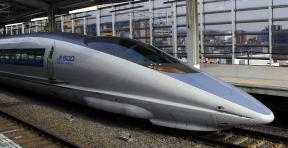
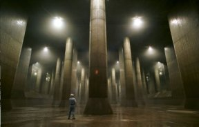

Ayer en un programa de divulgación científica del canal <a href="http://www.tvc.es">TVCi</a> de catalunya, hicieron varios reportages aunque sólo pude ver los últimos. Uno trataba de los superconductores y los imanes eléctricos y superconductores con hidrógeno (creo...), salió una pequeña reseña al tren bala de japón. (Foto sacada de <a href="http://es.wikipedia.org/wiki/Tren_bala">Wikipedia</a>)

Enseñaron como el tren bala desde la estación (en reposo) hasta que llega a los 100km/h lleva unos pneumáticos que tocan el suelo, una vez pasada esa velocidad las ruedas se levantan y el tren empieza a levitar a más de 150km/h hasta los 300km/h que puede llegar a alcanzar, una vez subidos los pneumáticos y llegada una velocidad media digamos unos 250km/h la bateria se para y el tren sigue su inercia a esa misma velocidad.
Lo que no enseñaron es como funciona el sistema de parada, porque una vez parada la bateria no hay muchas maneras de parar el tren, y con esa duda me quedé...

En otro reportaje explicaron que en tokyo llevan 12 años construyendo bajo tierra este enorme sistema hidráulico para prevenir inundaciones durante la temporada de lluvias. Cuando la gigantesta obra de ingeniería esté terminada, podrá evacuar 200 toneladas de agua por segundo gracias a unas enormes turbinas de 14.000 caballos de potencia. Mirad <a href="http://www.g-cans.jp/photo/">estas fotos</a>.

