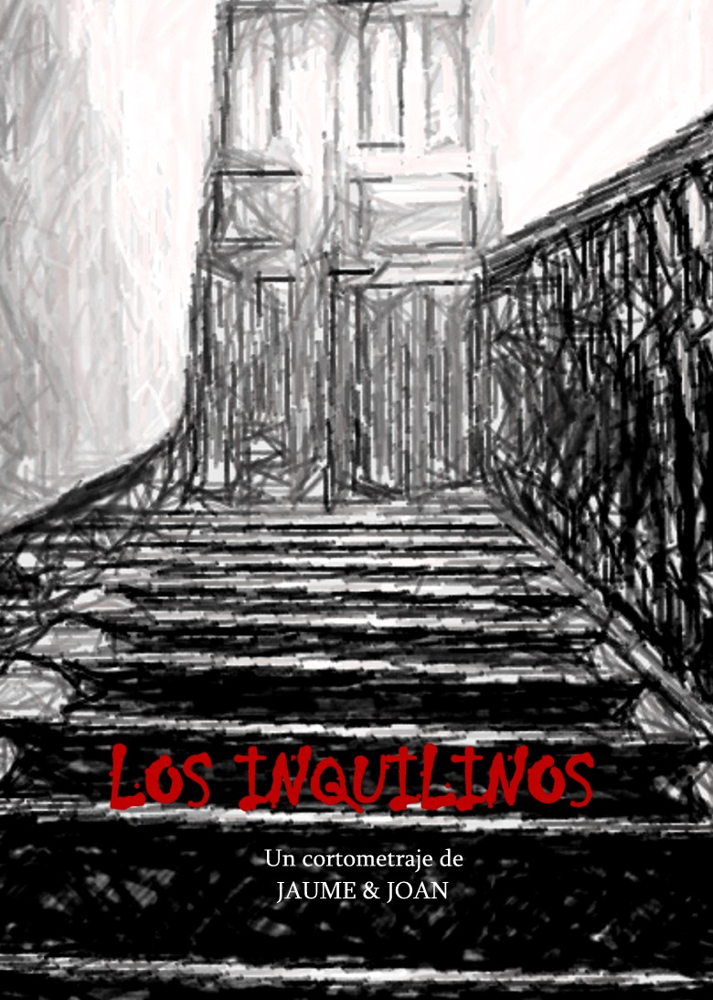

Después de varias semanas de montaje, hemos terminado el cortometraje: Los Inquilinos. Un corto de terror con bastantes escenas de tensión, en el que la cantidad de "sangre artificial" utilizada se cuenta por litros. 

El argumento trata sobre tres parapsicólogos que aceptan un trabajo en la casa de una ancianita, pero la situación se les va de las manos ya que no son fantasmas lo que encuentran, sino algo mucho peor. A primera vista parece el típico guión de una peli de serie B, pero la trama que se desarrolla es bastante más compleja... No quiero desvelar más, es mejor que lo veais.

<iframe src="http://player.vimeo.com/video/209518?title=0&amp;byline=0&amp;color=679AF1&amp;portrait=0" frameborder="0"></iframe>

