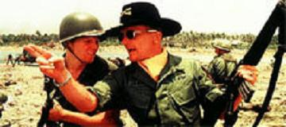

<blockquote>"¿Hueles eso? ¿Lo hueles, hijo? Es el napalm. Me gusta el olor del napalm, sobre todo cuando amanece. Una vez bombardeamos una colina sin parar durante doce horas y cuando acabamos de machacarla subí a ella. No encontré nada, salvo el cadáver de un viet. ¡Pero qué olor aquél! ¡Allí olía a victoria!"</blockquote>

&#8212; Coronel Kilgore (Apocalypse Now)
