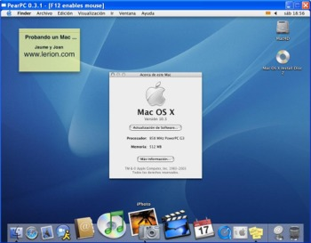

Siempre he tenido curiosidad por probar un sistema <a href="http://www.apple.com/es/macosx/">Mac OS</a>, pero la única manera de usarlo era comprar un Macintosh. Además con los nuevos productos de precio asequible que ha presentado <a href="http://www.apple.com/es/">Apple</a>  como el <a href="http://www.apple.com/es/macmini/">Mac Mini</a> se hace muy tentadora la idea de hacerme con uno ;) 
Pues bien, a la espera de <a href="http://www.cherryos.com/">CherryOS</a>, hay un emulador que permite arrancar un sistema Mac en un Intel y además es bastante sencillo de hacer funcionar. El emulador que aún está en fase de desarrollo se llama <a href="http://pearpc.sourceforge.net/">PearPc</a>, de momento es muy lento y no te reproduce sonido ni accede a dispositivos USB, pero para trastear tienes más que suficiente.

Ahora mismo tengo rulando un Mac OS X v.10.3 "Panther" en un AMD 2500+ con 1Gb de ram (esto me ha quedado un poco friki ;D ).

