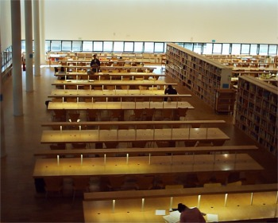

 
Estudiar. Esa palabra que con tan sólo oirla se estremecen algunos,  es lo que llevo haciendo desde hace unas semanas. Recluido en la biblioteca durante la mayor parte del día acabas pensando que no está tan mal eso de no separar los ojos de pedazos de celulosa reciclada y comprimida, e incluso te puede llegar a gustar lo que estudias y la sensación de estar rodeado de tanta gente y tan sólo a la vez.
Todo este tiempo de preparación para unos examenes que duran unas horas. Parece un poco absurdo. Nunca he creído en los exámenes, aunque reconozco que es la forma mas sencilla y económica de seleccionar a las personas.
Ésta es la razón por la cual no puedo poner "posts" con la frecuencia que me gustaría, aunque la rana Leriano está ultimando los detalles del contrato para rodar un nuevo micro-cortometraje. Pronto más notícias.
