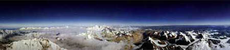

Desde el Everest: 4100 x 500 píxeles, por Roddy Mackenzie. Me encantaría haber sido yo el que hizo la foto, es impresionante.

(Vía  <a href="http://antwrp.gsfc.nasa.gov/apod/ap050306.html">Astronomy Picture of the Day</a>).

Algunos datos de interés extraídos de <a href="http://es.wikipedia.org">Wikipedia</a>:

<blockquote>El monte Everest es la montaña más alta de la Tierra, con 8.850 metros de altitud. Está localizada a 24° 59' 16" N, 86° 56' 40" E en el Himalaya, en el continente asiático, y marca la frontera entre Nepal y Tíbet. En Nepal es llamado Sagarmatha y en el Tíbet Chomolungma (madre del universo) Qomolangma Feng. La montaña fue nombrada Everest en honor de Sir George Everest, británico, topógrafo general de la India, en 1865.</blockquote>

