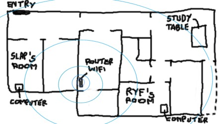

- 2 LinkSys WMP54G: 59,99 euros (unid.)
- 1 Router Xabi 7768r colgado en la pared de la cocina (muy disimulado): 36,99 euros  
- 4 horas de mano de obra con cambio de lineas, microfiltros... etc : 0 euros

Tener internet en casa ... no tiene precio :)
