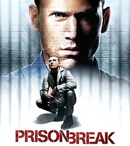

Prison Break es una de esas series de calidad que últimamente siguen la estela de "Lost". Aquí en España la emiten en laSexta o en FoxTV. Aunque como de costumbre (y últimamente va a peor) el doblaje es lamentable. Por eso prefiero verla en versión original subtitulada. Por si alguien no la conoce todavia os dejo un poco de info, que espero que os sirva para que os animeis a verla:

>Michael Scotfield es un hombre desesperado en una situación desesperada. Su hermano, Lincoln Burrows, está en el corredor de la muerte para perder la vida en unos pocos meses por un asesinato que Michael está convencido que no cometió. Sin tener otra opción para ayudar a su hermano y con el tiempo corriendo en su contra, Michael atraca un banco para ser encarcelado en la Prisión de Fox River State. Una vez dentro, Michael -un ingeniero de estructuras que ha formado parte en el diseño la cárcel- comienza a ejecutar un pan para sacar a su hermano de ahí y probar su inocencia.  
>
>Con la ayuda de su compañero de celda, Sucre, Michael empieza a alinearse con un dispar grupo de prisioneros como John Abruzzi (Peter Stormare) -el cabecilla del grupo- y Charles Westmoreland (Muse Watson), el supuesto secuestrador de D.B. Cooper. En el exterior, Michael sólo tiene un aliado, su abogada y amiga de la infancia, Veronica Donovan (Robin Tunney), que también es la antigua novia de su hermano Lincoln. Mientras, el hijo de 15 años de Lincoln, LJ (Marshall Allman), va a la deriva sin la positiva influencia de su tío Michael.

Si os preguntáis cómo pueden ser hermanos con diferente apellidos, tiene una explicación. El padre de ambos los abandonó antes de nacer Michael, el menor; y la madre le puso su apellido: Scofield.

A lo largo de la serie la trama se va complicando y tiene giros argumentales muy buenos. Además, todos los detalles del plan de Michael se nos van desvelando poco a poco y nos mantienen en vilo toda la serie. Porque más de una vez todo parece estar perdido.

A mi personalmente me ha sorprendido, y la encuentro una serie muy interesante. La recomiendo a todo el que tenga unos 45 minutos libres a la semana. ;-)
