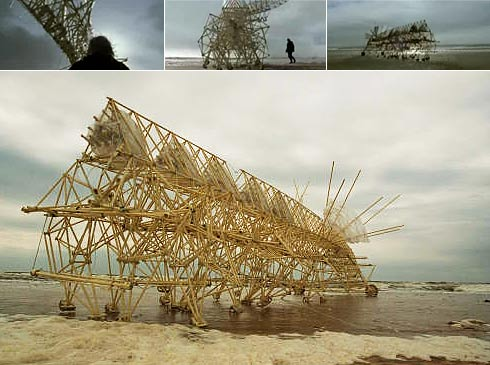

Navegando por la red encontré unas imágenes de estructuras en movimiento realmente curiosas creadas por un holandés llamado <a href="http://en.wikipedia.org/wiki/Theo_Jansen">Theo Jansen</a>. Sus creaciones parecen tan orgánicas que desde lejos se confundirían con inmensos insectos, pero están hechas a partir de tubos de plástico flexible y cinta adhesiva. Nacen dentro de un ordenador en forma de algoritmo, pero no requieren motores, sensores o ninguna clase de tecnología avanzada para cobrar vida. Se mueven gracias a la fuerza del viento de la costa holandesa. Impresionante.

Theo Jansen: "Empecé a construir animales hace 15 años. Los primeros que hice no eran muy fuertes. Incluso no podían caminar o estar parados. Pero una noche tuve una visión sobre el principio del movimiento de sus pies. Así que utilizando tubos de PVC (cosa que todavía uso) construí un modelo con la computadora intentando calcular la mejor manera de crear un movimiento de pasos. No intenté imitar animales. Quería hacer algo nuevo. Más tarde descubrí que los verdaderos animales utilizaban los mismos principios que yo."

BMW emitió un <a href="http://www.youtube.com/watch?v=a7Ny5BYc-Fs&eurl">anuncio con una de sus creaciones</a>, además puedes encontrar videos en su <a href="http://www.strandbeest.com/">página web</a>.
