He visto que algunos blogs han publicado su lista de los 10 mejores videojuegos según su criterio, y me ha encantado la idea. De hecho, ya hacía tiempo que quería hacer un post así.

Ahí va mi lista:

<strong>#10: Bat Man</strong>
Recuerdo este juego con muchísima nostalgia. Fué el primer videojuego que tuve, y nada menos que en un Amstrad PCW. Pasé infinidad de horas intentando resolver los puzzles y laberintos de habitaciones que tenía y, por cierto, nunca logré terminarlo.

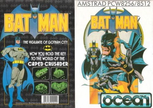

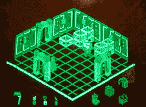

<strong>#9: Alex Kidd in Miracle World</strong>
Este videojuego venía incorporado en la Master System II. Tampoco conseguí pasármelo, ya que el hecho de no poder guardar la partida y tener que empezar desde el principio me desesperaba. Pero no por eso deja de ser mítico. Me encantaba el juego de Piedra-Papel-Tijera XD.

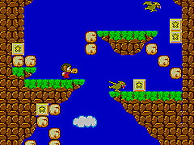

<strong>#8: Streets of Rage</strong>
Juego de Megadrive estilo arcade que se podía jugar por parejas y trataba de peleas callejeras. No sé porqué me llegué a viciar tanto, pero fué mi juego preferido durante todas las vacaciones de verano. Por cierto, la música era espectacular.

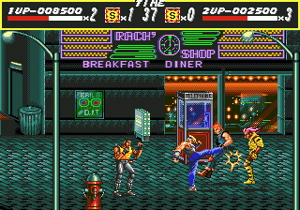

<strong>#7: Duke Nukem 3D</strong>
El único e indiscutible rey de los FPS. Protagonizado por Duke Nukem, el héroe más macarra de la historia, el carisma de dicho personaje hacía ganar muchos enteros al juego.
Pero lo que convertía a éste juego en una obra maestra eran los detalles: el poder destrozar cada elemento del mobiliario, usar los urinarios públicos y, sobre todo, las fases ambientadas en ciudades y entornos "reales" que suponían todo un avance respecto a los pasillos espaciales de "Doom".

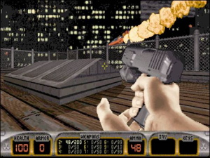

<strong>#6: Saga Jedi Knight</strong>
Poco tengo que comentar de esta saga. Me los pasé todos y creo que en los juegos hay momentos como estar infiltrándote en una nave del Impero mientras suena la banda sonora de Star Wars de fondo que son insuperables.

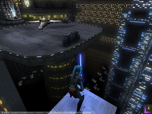

<strong>#5: Baldur's Gate</strong>
El primer juego de rol puro que jugué, y me atrevería a decir que es el mejor hasta el momento (con permiso de NeverWinter Nights). Este juego daba una libertad de acciones asombrosa con lo que te podías perder y tirarte días realizando historias paralelas sin avanzar en el guión principal. Un "Must Have" que todo rolero de pro debería tener en su estantería.

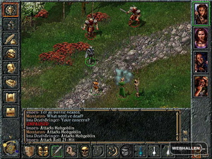

<strong>#4: Half Life</strong>
Impresionante combinación de ciencia-ficción, gráficos y una inteligencia artificial muy desarrollada para su época. Lo mejor de este juego es su historia, que parecía sacada de un guión de cine y conseguía meterte totalmente en el juego.

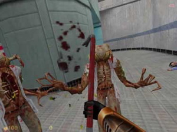

<strong>#3: Tetris</strong>
Tetris es un caso aparte, un juego eterno al que nunca me canso de jugar (y el que me hizo gastar más pilas en la Game Boy).

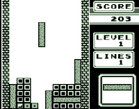

<strong>#2: The Dig, Loom, Indy 3, Maniac Mansion...</strong>
Las aventuras gráficas de la antigua Lucasfilm han sido los juegos que más me han marcado. Me los he pasado todos al menos un par de veces. Y pese a que tienen más de diez o quince años, todavía sigo disfrutando de ellos.

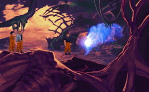

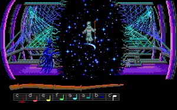

<strong>#1: Monkey Island I & II</strong>
La aventura gráfica por antonomasia. Guybrush Threepwood, La gobernadora Elaine Marley, El pirata fantasma LeChuck... forman parte del imaginario colectivo de mi generación. Inolvidable. Por cierto, guarda con la película Piratas del Caribe 2 algunas escenas calcadas (diría que flagrante plagio -pero supongo que consentidas-) como la de la casa de vudú en el pantano.

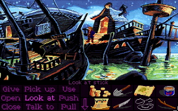

<strong>#Mención Especial: World of Warcraft</strong>
Es el juego que estoy jugando en estos momentos. Se trata de un "mmorpg" que ha batido récords de todo tipo. No lo pongo en el "Top 10" porque todavía no he jugado tanto como para que desbanque a alguno de los de arriba, pero como siga así va a subir puestos como la espuma :).

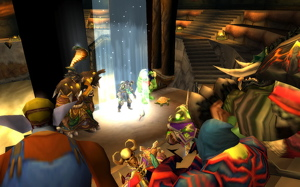

Bueno, eso es todo. Me gustaría que dejarais comentarios con vuestro Top 10 también. Seguro que hay muchos juegos que me he dejado en el tintero, pero no pueden estar todos.
