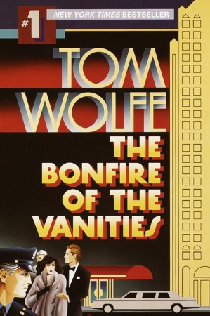

<b>Título: </b><a href="http://www.casadellibro.com/fichas/fichabiblio/0,1094,2900000109874,00.html?codigo=2900000109874">La hoguera de las vanidades</a>  
<b>Autor: </b>Tom Wolfe  
<b>Tema: </b>Novela documental  
<b>Editorial: </b>Anagrama  
<b>Páginas: </b>636  
<b>ISBN: </b>8433920545  
<b>Idioma: </b>Castellano  
<b>Título original: </b>The Bonfire of the Vanities

Esta novela ha sido calificada como <em>la novela de Nueva York</em>, donde el autor describe como la codicia de Wall Street y las mansiones de Park Avenue conviven con las pobres calles del Bronx. La caracterización de los personajes está muy lograda, especialmente las diferencias gramaticales entre unos y otros. 

Al principio, el libro puede parecer complicado, ya que los sucesos se presentan desde el punto de vista de por lo menos seis personajes, pero, una vez que se centra en el tema, es imposible dejar de leerlo. <strong>Muy recomendable</strong>.

Sinopsis:
<blockquote>El protagonista es un yuppie, un asesor financiero que se ha convertido en la estrella de una firma de brokers, pero que se ve inmerso en rocambolescas dificultades jurídicas, matrimoniales e incluso económicas a partir de la noche en que se pierde por las calles del Bronx cuando recogía a su amante del aeropuerto Kennedy.

A partir de esta peripecia, Tom Wolfe va hilando una compleja trama que le permite presentar el mundo de las altas finanzas, los restaurantes de moda y las exclusivas parties de Park Avenue, así como el submundo picaresco de la policía y los tribunales del Bronx, y también el mafioso universo de Harlem y las nuevas sectas religiosas.</blockquote>
