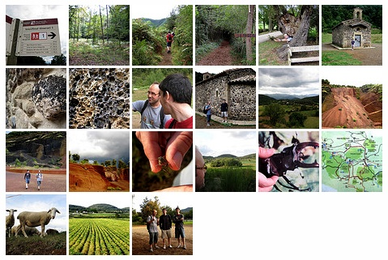

<a href="http://www.flickr.com/photos/lerion/sets/72157607282947477/">Set de fotos</a> de la excursión que hicimos al parque natural de la Garrotxa, la zona volcánica mejor conservada de la península ibérica.
